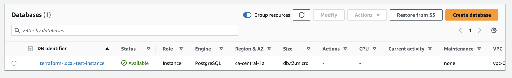
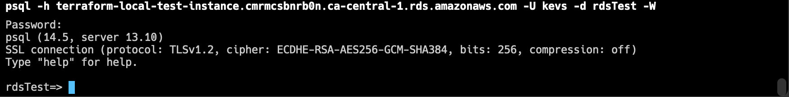

# RDS

This directory contains the minimum code to setup a new RDS in AWS.

After apply the code, you should be able to see the next resources:

* VPC
* Subnet
* Security group
* Internet gateway
* Route table
* Route table association
* RDS - DB instance
* RDS - DB subnet group

## Prerequisites

* Terraform >= 1.5.1
* Access to AWS

## Steps

> Before starting with the implementation be sure to have access to the target AWS account.


1. Create a new workspace. Is very recommended to use another workspace instead of the default one.

```
terraform workspace new local
```

2. Initialize the project.

```
terraform init
```

3. Set the username and password of your database as environment variable, it strategy prevents to upload in the credentials into the repository.

```bash
export TF_VAR_db_username="<your value>"
export TF_VAR_db_password="<your value>"
```

4. Get the especulative plan to verify the resources creation. Don't forget to update the `local.tfvars` to override the default values.

```
terraform plan -var-file=local.tfvars
```

5. Apply your infrastructure
```
terraform apply -var-file=local.tfvars
```

_For testing purposes this project uses the local state, however for shared environments is strnogly recommended to use another backend like Terraform Cloud, or the S3 bucket approach_

## Output

Once the apply finishes you should be able to see the DB instance.



The previous implementation allows to connect directly to the DB, to achive that, you must to install the db client. For example, the engine used in this project is Postgres, if you want to connect you must to execute the next command.

```
psql -h terraform-local-test-instance.cmrmcsbnrb0n.ca-central-1.rds.amazonaws.com -U <username> -d <db name> -W
```

_The CLI enables a prompt to write the password_

Then you should be able to see somtehing like this

